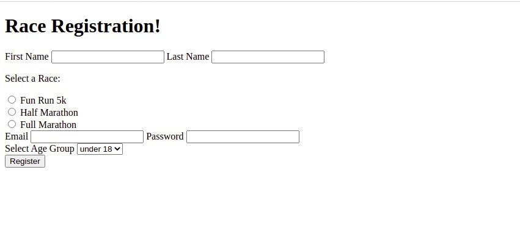

<h1> 🔭 What has been learned: </h1>

- Introducing HTML Tables
- Tables: TR, TD, and TH Elements
- Tables: Thead, Tbody, and Tfoot Elements
- Tables: Colspan & Rowspan
- The Form Element
- Common Input Types
- The All-Important Label
- HTML Buttons
- The Name Attribute
- "Hijacking" Google & Reddit's Search
- Radio Buttons, Checkboxes, & Selects
- Range & Text Area
- HTML5 Form Validations
- Creating A Marathon Registration Form Intro

 
