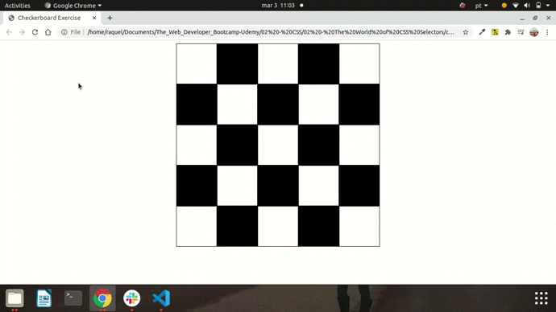

<h1> 🔭 What has been learned: </h1>

- Universal & Element Selectors
- The ID Selector
- The Class Selector
- The Descendent Selector
- The Adjacent & Direct-Descendent Selectors
- The Attribute Selector
- Pseudo Classes
- Pseudo Elements
- CSS Cascade
- TIP: Chrome Dev Tools & CSS
- Inline Styles & Important
- CSS Inheritance

 
<h2> Checkerboard exercise: I added ":hover" changing the color. </h2>

