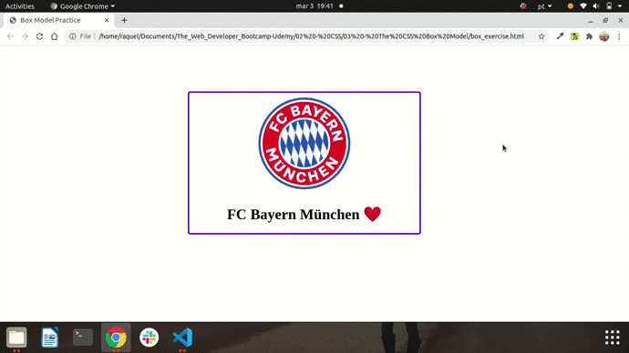

<h1> 🔭 What has been learned: </h1>

- Box Model: Width & Height
- Box Model: Border & Border-Radius
- Box Model: Padding
- Box Model: Margin
- The Display Property
- CSS Units Revisited
- CSS Units: ems
- CSS Units: rems

 
<h2> Box exercise: I added some border style and animation. </h2>

