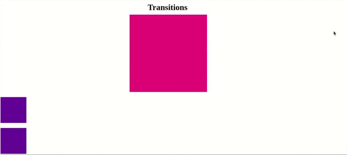
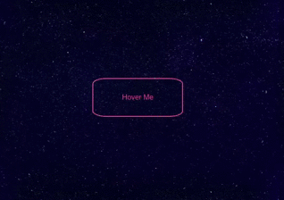
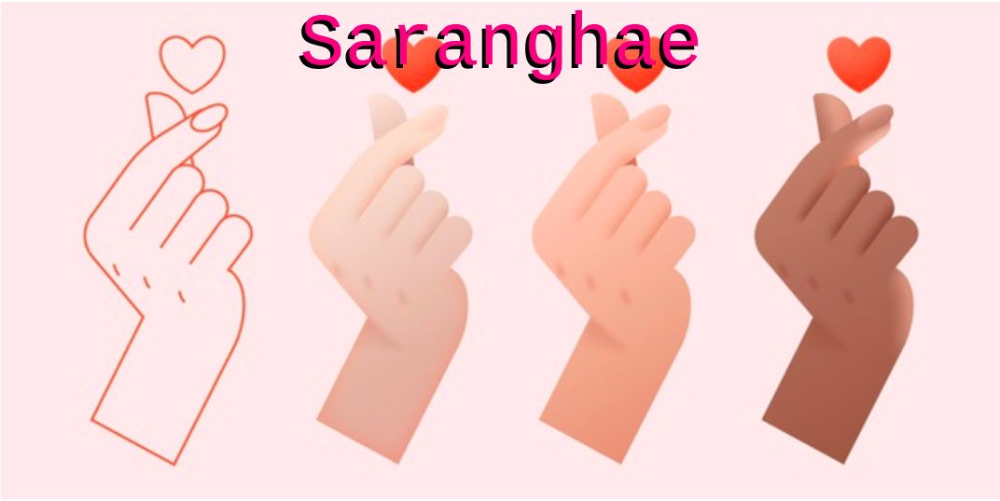

<h1> 🔭 What has been learned: </h1>

- Opacity & The Alpha Channel
- The Position Property
- CSS Transitions
- The Power of CSS Transforms
- Fancy Button Hover Effect CodeAlong
- The Truth About Background
- Google Fonts
- Photo Blog CodeAlong 

 
<h2> Transitions exercise: </h2>

 
 
<h2> Hover button: </h2>

 
 
<h2> Background: </h2>

 
 
<h2> Photo Site Katarina: </h2>

